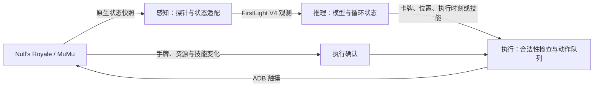

# RoyaleHarness

**面向《皇室战争》的感知、推理与自动操控框架。**

A perception–inference–action harness for Clash Royale.

RoyaleHarness 将 FirstLight 的 V4 策略模型接入 MuMu 中运行的 Null’s Royale，
完成 **获取实时战况 → 模型决策 → 触摸下牌 → 执行结果确认** 的闭环。
项目重点是让已有模型实际运行于游戏中，包括观测适配、决策调度、坐标转换和动作执行。

当前版本：**`v0.1.0-preview`**。
目前使用原生数据感知；视觉感知是后续方向。当前接入目标为 Null’s Royale，未适配官方客户端。

[快速开始](#快速开始) · [日常使用](#配置和日常使用) · [常见问题](#常见问题) · [开发与验证](#开发与验证) · [路线图](#路线图)

## 项目如何工作



| 层级 | 当前实现 | 主要职责 |
| --- | --- | --- |
| 感知 | 原生只读探针与 Python 适配器 | 读取实时状态，核对对象身份、席位、坐标及关系，转换为模型观测 |
| 推理 | FirstLight V4 与已有权重 | 保留 LSTM、动作历史、每 5 tick 决策窗口和顺序微动作 |
| 执行 | ADB / Android 触摸输入 | 选牌、下牌、已支持英雄的技能点击，检查时效并等待结果确认 |

动作通过触摸执行，后台探针用于状态获取与执行观测。项目目前复用已有权重，
不包含新模型训练流程；运行无需 `IL_Replay`，也无需安装离线训练引擎或 Clash-Royale-Battle-Engine。

## 当前能力

- **实时自动下牌**：将观测送入原模型，把决策转换为屏幕操作，并跟踪执行结果。
- **坐标与席位适配**：处理模型格子、原生世界坐标和屏幕位置之间的转换，提供地面校准与核对工具。
- **战况输入**：接入手牌与循环、单位与塔、持续效果、攻击目标、部分投射物与战斗状态。
- **部署分组**：根据已验证来源关联同次部署的成员，支持不同批次分组和阵亡后的成员减少。
- **特殊形态**：重点覆盖英雄火枪手的部署与单按钮技能、觉醒小骷髅和觉醒加农炮。
- **运行与排错**：提供只观察模式、遥测记录、离线回放比较、启动检查、稳定探针安装与恢复。

实现细节见 [架构说明](docs/ARCHITECTURE.md)。

## 支持范围

- ARM64 版 Null’s Royale、已启用 Root 和 ADB 的 MuMu。
- 游戏 `libg.so` SHA-256 必须为
  `110aa2b5cac391c498645e072b0d88729428c2c2845e7e2737ca8ee979059783`。
  版本号相同不保证二进制或内容相同；不匹配时安装器会停止。
- 参考屏幕布局为竖屏 1080×1920，其他布局需要重新校准。
- 已重点实机验证速猪及英雄火枪手、觉醒小骷髅、觉醒加农炮。
- General 使用完整目录；可执行的卡牌形态、英雄技能与塔兵状态取决于桥接层的支持范围。
- 默认 `reference` 输入基线；`extended` 为精确事件对照实验。完整创建链实验未作为默认功能发布。

详见 [架构与边界](docs/ARCHITECTURE.md)、[验证记录](docs/VALIDATION.md)。

## 环境与依赖

| 项目 | 环境要求 |
| --- | --- |
| 主机 | Windows；启动与构建脚本面向 PowerShell |
| 模拟器 | MuMu，启用 Root 与 ADB，连接正确的实例 |
| 游戏 | ARM64 Null’s Royale，原生库指纹与上述支持版本一致 |
| 显示 | 1080×1920 竖屏参考布局；首次使用需核对地面与手牌位置 |
| Python | 3.12 |
| 推理环境 | PyTorch 2.11.0 + CUDA 12.8；另提供 CPU 安装选项 |
| 上游依赖 | 固定提交的 FirstLight 推理代码、冻结目录数据和所选权重 |
| 编译工具 | 使用预编译探针无需 NDK；重新构建验证使用 NDK r27c |

发行包包含本项目源码与稳定探针，不包含模型权重、上游目录资源、游戏 APK 或原始 SDK。

## 快速开始

以下命令在**发布目录**中执行。目录名称可自定；压缩包内目前保留
`CR_PlayCard_Agent-v0.1.0-preview` 名称，README 使用项目名 RoyaleHarness。

推荐目录结构：

```text
workspace/
├── FirstLight_CR/             # 单独获取的上游代码、目录数据与权重
└── RoyaleHarness/             # 本项目发布目录，也可保留解压后的名称
    ├── README.md
    ├── setup.ps1
    └── settings.example.json
```

1. 从 [FirstLight 上游](https://gitlab.com/firstlight3/FirstLight_CR) 获取代码与所需模型权重，
   使用提交 `28d66cc0a5d65888515e22fdf22f11d783b65efb`。Git LFS 文件必须下载为真实文件。
   保留 `native_runner/data/competitive` 的冻结目录数据。
   本包不含上游代码、目录数据或权重；依赖指纹见 `upstream.lock.json`。
   不需要执行上游构建／安装离线 APK 的步骤。
2. 安装 Python 3.12，在本项目目录打开 PowerShell：

   ```powershell
   powershell -ExecutionPolicy Bypass -File .\setup.ps1
   ```

   脚本创建本项目 `.venv`，安装本机验证使用的 Torch 2.11.0 / CUDA 12.8 依赖组合。
   CPU 使用 `-TorchBuild cpu`，并将配置中的 `device` 改为 `cpu`。
   已有 Python 可用 `-Python 'C:\path\python.exe'`；现有推理环境也可通过
   `CR_AGENT_PYTHON` 环境变量供启动器使用。
3. 编辑生成的 `settings.local.json`：设置 `firstlight_dir`、`adb_path`、`adb_serial`。
   示例路径只是示例，ADB 路径和端口应从自己的 MuMu 实例获取。
   路径相对于配置文件所在目录解析，含空格路径受支持。
   多实例同时运行时，每个副本设置不同的 `probe_port`；设备内部端口固定 26888。
4. 打开模拟器，在 MuMu 中启用 Root 与 ADB；游戏停在大厅。
   使用配置中的 ADB 连接实例，确认所选实例为 `device`：

   ```powershell
   $settings = Get-Content .\settings.local.json -Raw | ConvertFrom-Json
   & $settings.adb_path connect $settings.adb_serial
   & $settings.adb_path devices
   ```

   上述命令适用于示例中的 TCP 实例地址；使用 `emulator-…` 序列号时只需检查 `devices`。
   运行检查（此时账号未设置会报该项失败，其他项可继续检查）：

   ```powershell
   .\.venv\Scripts\python.exe tools\preflight.py --device-check --model hog26
   ```

5. 安装稳定探针：

   ```powershell
   powershell -ExecutionPolicy Bypass -File .\probe\deploy_probe.ps1 -Check
   powershell -ExecutionPolicy Bypass -File .\probe\deploy_probe.ps1
   ```

   `-Check` 只检查本地文件。实际安装会保留原始 SDK、停止并重启游戏，不会匹配或下牌。
   原始 SDK 只从本人的设备保存，不随本项目分发。
6. 在 AI 未启动时手动开一局好友战，两边使用不同卡组，运行：

   ```powershell
   .\.venv\Scripts\python.exe tools\inspect_players.py
   ```

   对照自己的手牌和卡组 ID 找到所属行，把原生 `account_id` 填入配置。
   这是内部数字 ID，不是个人主页的 `#玩家标签`；不要固定填写 owner，席位会变化。
7. 按 [坐标核对](docs/CALIBRATION.md) 验证自己的界面；之后将配置中的
   `calibration_verified` 设为 `true`。英雄按钮需要单独校准。
8. 双击 `start_agent.bat`。首次建议选“只观察一局”，确认进入对战后有连续决策与正确卡组。
   正式使用选自动对战，等待 `ready` 后再手动匹配。Ctrl+C 停止。

完成账号设置后，再运行一次 `preflight.py --device-check --model hog26`，
确认各项检查通过。使用其他权重时，将 `hog26` 换成对应别名，例如 `general`。

## 配置和日常使用

菜单提供运行方式、模型、特殊形态、输入方案四组选项。切换 General 不会自动扩大执行支持范围。
英雄火枪手未校准技能按钮时，技能点击会禁用。

| 菜单 | 可选内容 |
| --- | --- |
| 运行方式 | 自动对战／自动一局／只观察／只观察一局 |
| 模型 | 速猪 specialist2、速猪 specialist1、General、IL、active IL |
| 特殊形态 | 自动识别已支持形态；或禁用特殊形态执行用于排错 |
| 输入方案 | `reference` 原版规则基线；或 `extended` 精确事件对照实验 |

默认模型为速猪 specialist2。参考卡组为：**野猪骑士、火枪手、小骷髅、冰人、冰精灵、加农炮、火球、滚木**。
使用其他卡组应选择合适权重并检查当前卡牌／形态支持情况，不应继续套用速猪专用模型。

常用命令示例：

```powershell
# 只观察一局：推理并记录，不下牌
.\.venv\Scripts\python.exe main.py --checkpoint hog26 --dry-run --once

# 使用通用模型自动执行一局；等待 ready 后手动匹配
.\.venv\Scripts\python.exe main.py --checkpoint general --once

# 在已有本地采集记录上比较两套输入，不操作游戏
.\.venv\Scripts\python.exe tools\compare_observation_profiles.py --help
```

`settings.local.json` 可选项还包括 `checkpoints_dir`、`calibration_path`、
`ability_calibration_path`。`CR_AGENT_SETTINGS` 可指定另一份配置，`device` 可设 `cuda:0` 或 `cpu`。
手动命令行支持 `--account-id`、`--device`、`--dry-run` 等；详见 `main.py --help`。

只观察模式仍会建立 ADB 连接和端口转发并读取屏幕尺寸，但不下牌或点击技能。
只读采集工具：`tools/capture_native.py --seconds 60 --output diagnostics/capture.jsonl`，
运行前用 `tools/inspect_players.py` 建立端口转发。

## 恢复原始 SDK

```powershell
powershell -ExecutionPolicy Bypass -File .\probe\deploy_probe.ps1 -Restore
```

恢复仅使用本次设备和安装目录对应的 `local/backups` 备份，会重启游戏。
不要将其他账号、其他实例或旧安装目录的备份复制过去。重装／更新游戏后需重新进行兼容检查。
备份不能省略；保留至确认不再需要恢复为止。

## 常见问题

**其他人的同版本游戏可以直接用吗？**

核心桥接代码和稳定探针可以复用，但仍需配置本机路径、模拟器连接、账号身份和坐标。
游戏库指纹不匹配时需要重新适配；只看版本号不能判断兼容。

**需要每个用户重新绑定所有卡牌 ID 吗？**

同一受支持游戏数据版本通常不需要。卡牌目录与词表来自冻结的上游依赖。
但“识别 ID”与“完整支持该卡牌机制和动作”是两回事，尤其是英雄技能、觉醒状态和塔兵资源。

**启动后为什么一直等待，或者英雄不点技能？**

先检查控制台的 `waiting`／`telemetry_rejected`／`ability_input_disabled` 信息和本地 `logs`。
常见原因包括未进入对局、账号身份不匹配、遥测断开、形态不受支持或英雄按钮未校准。
模型也可以主动选择 `wait`；日志中的等待不一定是程序卡死。

**当前模型接入有哪些限制？**

实时观测与训练观测在采样、完整可见性和特殊机制覆盖上仍有差异。
执行时延和重复施法是后续优化方向，详见 [架构与边界](docs/ARCHITECTURE.md)。

**为什么 `extended` 信息更多，却不是默认选项？**

精确事件更多不保证更接近已有权重的训练观测，也不保证决策更好。
保留 `reference` 作为基线，便于对比输入变化，避免把额外字段误当作已证实的性能提升。

**现在能使用图像识别吗？**

当前发布版仍依赖原生数据。后续视觉感知需要对象跟踪、状态估计和缺失信息处理，
不是把截图直接替换到当前模型接口里即可完成。

## 目录结构

```text
RoyaleHarness/
├── agent/                       # 观测适配、模型推理、动作调度
├── bridge/                      # 遥测解析、机制状态、坐标与触摸执行
├── probe/                       # 原生探针源码、稳定产物、构建与安装入口
├── tools/                       # 环境检查、只读采集、离线审计与打包
├── tests/                       # 合成回归测试与原生测试源码
├── docs/                        # 架构、校准、验证与发行说明
├── main.py                      # 命令行运行入口
├── start_agent.bat              # 数字菜单入口
├── setup.ps1                    # 本地 Python 环境安装
├── settings.example.json        # 可分享的配置模板
├── upstream.lock.json           # 上游代码、目录和权重指纹
└── SHA256SUMS.json               # 受审查发行文件清单
```

运行时生成的 `settings.local.json`、`ability_calibration.local.json`、`logs`、`diagnostics`、
`local/backups` 和 `.venv` 留在使用者本地，不应加入发行包。

## 开发与验证

发布整理已通过 **224 项 Python 测试、10 项离线探针产物检查**，
速猪权重完成两席位离线推理，General 权重可加载。
发布源码的 Stable 构建与包内稳定二进制逐字节一致。
详细结果见 [验证记录](docs/VALIDATION.md) 和 [机器可读记录](release-validation.json)。

```powershell
.\.venv\Scripts\python.exe -m unittest discover -s tests -q
.\.venv\Scripts\python.exe test_pipeline.py --model
powershell -ExecutionPolicy Bypass -File .\probe\test_artifacts.ps1
```

原生探针源码位于 `probe`；只有重新编译的开发者需要 NDK（验证版本 r27c）：

```powershell
powershell -ExecutionPolicy Bypass -File .\probe\build_probe.ps1 -NdkRoot 'C:\Android\android-ndk-r27c'
```

构建输出候选产物，不覆盖发行包内锁定的稳定探针。发布安装器只安装稳定产物。
源码中的 `Experimental` 构建开关仅供开发研究，默认关闭。

重新打包使用 `tools/package_release.py`，只包含受审查且哈希匹配的文件。
修改源码或文档后，需要审查变更并更新 `SHA256SUMS.json`；打包工具不会自动接受变更。
输出 ZIP 已存在时会拒绝覆盖，请先将旧包移至另一个归档位置。
更多细节见 [发布说明](docs/RELEASE.md)。

## 路线图

- [x] 原生感知 → 原模型推理 → 触摸执行闭环。
- [x] 建立默认输入基线与可选精确事件对照方案。
- [x] 整理便携配置、首次检查、稳定探针安装与恢复。
- [ ] 对当前支持卡组进行持续实战评估，区分执行问题和策略选择。
- [ ] 扩大英雄、觉醒和塔兵机制覆盖。
- [ ] 引入视觉感知、对象跟踪与状态估计，评估与现有模型输入的兼容性。

## 反馈与贡献

反馈问题时，请提供系统与 MuMu 版本、游戏指纹、屏幕尺寸、所选模型／输入方案、
简短复现步骤，以及出错前后的必要日志片段。分享前移除账号 ID、本机路径和其他个人信息。
涉及左右镜像或落点偏移时，请说明当时的卡牌、地面目标和实际落点。

新增机制应说明数据证据、模型字段映射和未知状态的处理方式；
行为变更需要相应回归测试，提交时请附上测试方法、结果和支持范围。

## 致谢与许可证

模型架构、权重、观测／动作合约和多项探针布局来自
[FirstLight CR](https://gitlab.com/firstlight3/FirstLight_CR)。
RoyaleHarness 在此基础上提供面向当前在线测试环境的桥接与运行适配；本发行版没有修改上游权重。

本项目采用 **Apache-2.0**，见 [LICENSE](LICENSE)、[NOTICE](NOTICE) 和
[上游来源说明](probe/FIRSTLIGHT_NOTICE.md)。
原始游戏、SDK、APK、资源、对局和权重不在此包内，需从相应来源准备。
本项目与 Supercell、Null’s 和 MuMu 无隶属或背书关系，名称仅用于说明兼容对象。
